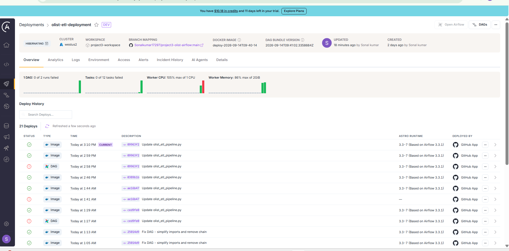
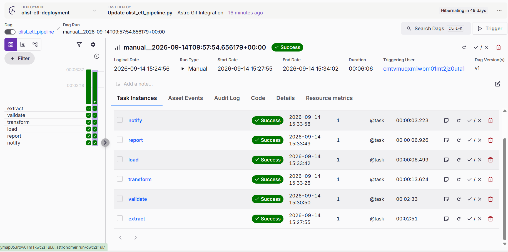

# Project 3 — Olist E-commerce ETL Pipeline

## Overview
An end-to-end Airflow-orchestrated ETL pipeline that extracts raw Brazilian 
e-commerce data from the Olist dataset, validates data quality, transforms 
and joins 4 tables, and generates a daily sales summary report.

## Pipeline Architecture

Raw CSV Files → Extract → Validate → Transform → Load → Report → Notify

## Tech Stack
| Tool | Purpose |
|---|---|
| Apache Airflow 3.x | Pipeline orchestration |
| Astronomer Cloud | Airflow deployment & monitoring |
| Python 3.12 | Pipeline logic |
| Pandas | Data transformation |
| GitHub Actions | CI/CD via Astro Git Integration |

## DAG Details
- **DAG ID:** olist_etl_pipeline
- **Schedule:** Daily (@daily)
- **Tasks:** 6 tasks (Extract → Validate → Transform → Load → Report → Notify)
- **Dataset:** Olist Brazilian E-commerce (110K+ orders)

## Task Breakdown
| Task | Description |
|---|---|
| Extract | Reads 4 Olist CSV files into Pandas DataFrames |
| Validate | Checks for nulls and duplicates in order_id |
| Transform | Joins 4 tables, filters delivered orders, adds audit columns |
| Load | Saves transformed data to olist_transformed.csv |
| Report | Generates sales summary by state and month |
| Notify | Logs pipeline completion with row counts |

## Data Sources
- olist_orders_dataset.csv
- olist_order_items_dataset.csv
- olist_customers_dataset.csv
- olist_order_payments_dataset.csv

## Output
- `olist_transformed.csv` — Clean delivered orders (110K+ rows)
- `sales_summary.csv` — Revenue aggregated by state and month

## Pipeline Run Results
- Total delivered orders processed: 96,478
- Pipeline duration: ~6 minutes
- All 6 tasks completed successfully

## Pipeline Screenshot

## Key Concepts Demonstrated
- Airflow TaskFlow API (@dag, @task decorators)
- Data quality validation (fail-fast principle)
- Multi-table joins across 4 datasets
- Idempotent pipeline design
- Cloud deployment on Astronomer

## Project Structure

project3-olist-airflow/
├── dags/
│ └── olist_etl_pipeline.py
├── data/
│ └── (Olist CSV files)
├── Dockerfile
├── requirements.txt
├── packages.txt
└── README.md

## Author
Sonal Kumar
GfK – An NIQ Company
